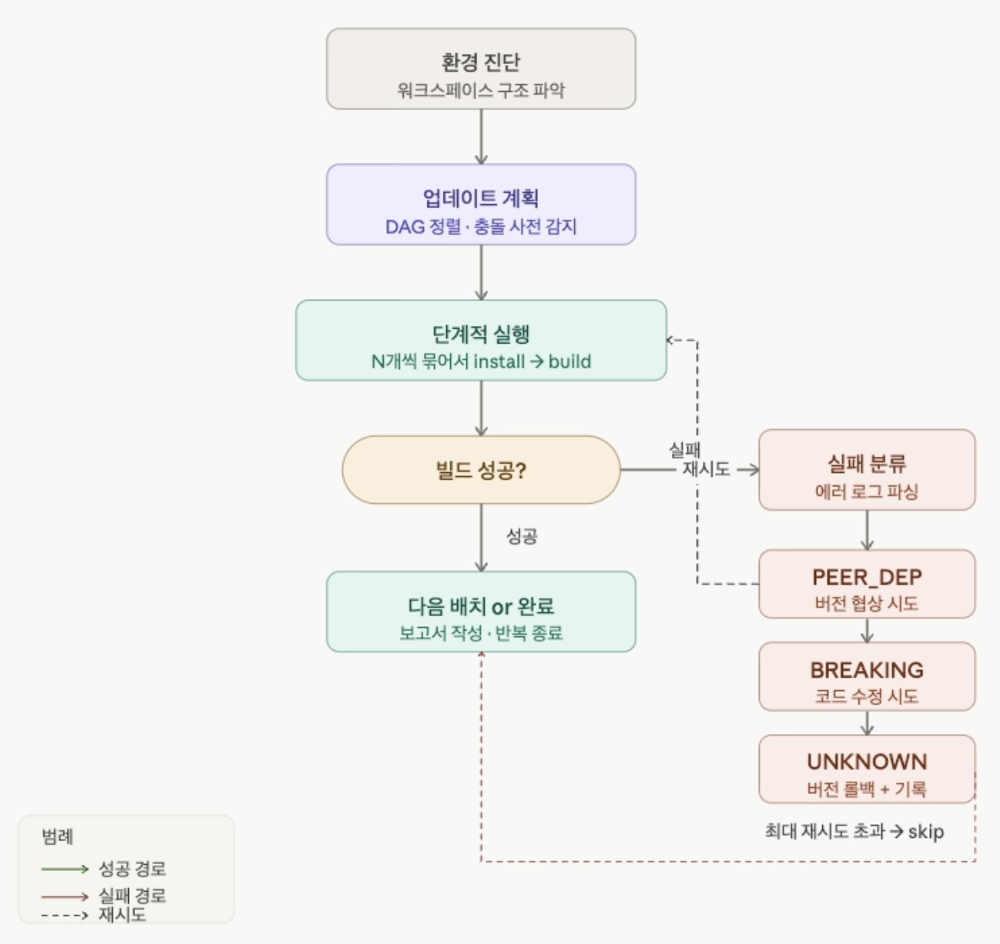

회사에서 ‘나는 어떻게 AI 를 활용하고 있을까?’ 라는 주제로 워크샵에서 발표를 진행하게 되었습니다. 이번 블로그 포스팅에서는 비개발자도 이해하기 쉽게 정리해보았습니다.

> 요구사항 주고 대화하면서 코드 짜달라고 해요!

이것도 맞지만 저는 AI 를 팀원처럼 활용하는 법 (?) 을 고민하고 싶었습니다.

단순히 코드를 짜주는 도구가 아니라, 문제 상황을 인지하고, 설계하고, 실패하면 다시 고민하고 실행하며 목표를 달성하는 팀원처럼요. 이러한 팀원을 만들기 위해 프로젝트를 진행했고, 그 첫 번째 프로젝트는 ‘패키지 버전 업데이트’ 였습니다.

## 현 프로젝트의 문제점

---

> 매우 낮은 패키지 버전과 밀려버린 업데이트. 많은 공수와 작업의 어려움

SW 개발에서 ‘패키지’는 개발자가 가져다 쓰는 부품이라고 비유할 수 있습니다. 컴퓨터 본체 구성에서도 CPU, SSD, 케이스 등… 조립을 위해 필요한 부품들을 직접 만들어 쓰는 것이 아닌 외부에서 구입하는 것이라고 이해하면 되겠습니다.

이러한 부품들은 계속해서 새로운 버전이 나옵니다. 이슈가 고쳐지고, 성능이 좋아지고, 보안 취약점들이 해결됩니다. 하지만 이러한 부품은 하나를 바꾸면 다른 부품들과 맞지 않는 경우가 생깁니다. → 패키지 버전 충돌

저희 프로젝트의 패키지를 살펴보면

| React (UI 프레임워크)      | 2년 전 버전 사용 중              |
| -------------------------- | -------------------------------- |
| Next.js (웹 서버)          | 2 메이저 버전 뒤처짐             |
| React Query (데이터 패칭)  | v4 (최신 버전 v5, API 대거 변경) |
| styled-components (스타일) | v5 (최신 버전 v6)                |

더해서 제가 담당하는 프로젝트는 ‘모노레포’ 구조입니다.

하나의 저장소에서 3개의 서비스를 동시에 관리하고 있고, 패키지 하나를 변경하면 이 3개의 서비스 모두에 영향이 갑니다.

## AI 없이 해결하려면?

---

수작업으로 진행한다면 아래와 같은 과정으로 진행되었을 것이에요.

1. 어떤 패키지가 얼마나 뒤처져 있는지 목록 파악
2. 각 패키지의 공식 마이그레이션 문서 읽기
3. 영향받는 코드 파일 찾아서 하나씩 수정
4. 빌드 실패 → 에러 메시지 해석 → 원인 찾기 → 다시 수정
5. 3개 서비스 각각 반복

단순 시간이 오래 걸리는 문제만이 아니었습니다. 에러 메시지를 해석하고, 충돌의 원인을 분석하고, 해결책을 선택하는 판단의 연속인 작업입니다.

따라서 해당 프로젝트를 진행하게 되면, 서비스 기능 개발은 잠시 미뤄두어야 할 것입니다.

## AI를 어떻게 활용했나?

---

### 1단계: 문제 분석을 함께

먼저 패키지 업데이트 우선순위를 세우기 위해, 패키지 현황 파악 명령어들을 실행하였고, 그 결과를 Claude 에게 공유하였습니다.

```jsx
# 1. 전체 outdated 목록 확인
npm outdated

# 2. 보안 취약점 확인
npm audit

# 3. 업그레이드 가능 버전 일괄 확인
npx npm-check-updates
```

이후, Claude는 사람이 읽기 어려운 로그들을 **‘우선순위와 대응 방법’**이 포함된 진단서로 바꿔주었습니다.

### 2단계: Agent에게 작업을 위임

해당 단계부터 AI 를 팀원처럼 활용해보았습니다. ‘이 코드를 고쳐줘’ 가 아닌 자율적으로 판단하고 실행하는 Agent 를 설계해보았습니다.

CLAUDE.md → AI 를 위한 업무 지침서

- Claude Code 는 프로젝트에 진입할 때, 해당 문서를 자동으로 읽습니다. 그리고 해당 지침서를 참고하여 작업합니다. AI 가 알아야 하는 모든 맥락을 담습니다.

```jsx
✅ 프로젝트 구조 (3개 서비스 + shared 패키지)
✅ 반드시 지켜야 할 업데이트 순서
✅ 사전에 알려진 문제점들 (peer dependency 충돌 목록)
✅ 실패 시 대응 절차 (최대 3회 재시도 → 롤백)
✅ 절대 규칙 (한 번에 전체 업데이트 금지, lockfile 직접 수정 금지)
✅ 배포 인프라 정보 (Dockerfile, GitHub Actions 구조)
```

저희 프로젝트에선 ‘배포 인프라 정보’ 마지막 항목이 중요했습니다. AI가 배포 인프라를 모르면 로컬에서 성공해도 서버에서 실패할 가능성이 있습니다.

사실, 이전에도 AI 를 활용하기 이전에 직접 업데이트를 시도했던 경험이 있습니다. 그 당시에도 배포에 문제를 겪었었기 때문에, 해당 내용도 마크다운 파일에 포함시켰습니다.



!image.png

위 사이클이 자동으로 돌아가는 Skill 을 세팅하고, `사람이 개입하지 않아도 스스로 분석하고 재시도 하는 것`이 이 Agent 의 가장 유용한 점입니다. 마치 패키지 업데이트 과제를 담당하는 팀원 같아요!

또한 절대 규칙으로 '실패해도 포기하지 말 것’, ‘문서화’ 를 추가해서 Agent 가 꼭 목표 달성을 하게 강제성을 주었어요.

### 3단계: 병렬로 작업

3개 서비스가 독립적이라면, 동시에 작업하면 더 빠릅니다.

Git Worktree 를 세팅하여, 다른 브랜치에서 해당 작업을 진행하게 하였습니다. 이로써 완전히 Agent 에게 해당 과제를 맡기는 것입니다. (저는 제 할 일을 하고요 😎)

## 회고 및 아쉬운 점

---

### 아쉬운 점 1: 방대한 양의 토큰 소모

AI 는 대화가 길어질수록 이전 내용을 계속 기억하고 있어요. 이 기억의 양을 “토큰”이라고 하는데, 토큰이 많을수록 비용이 올라갑니다.

저의 프로젝트에서는 패키지 업데이트를 하는데 매우 많은 토큰이 소모되었어요. 원인은 Agent 하나가 너무 많은 역할을 맡고 있었기 때문이라고 생각이 되었어요.

- AS-IS : 하나의 Agent가 → 계획 + 분석 + 실행 + 검증을 모두 담당
- TO-BE : 역할을 나눠서 → 각 Agent가 필요한 맥락만 보유

**개선 방향**

- 패키지별 새 컨텍스트에서 시작
- AI가 마이그레이션 방법을 스스로 탐색하는 대신, 사전에 `before` → `after` 가이드를 제공해 탐색 비용 절약

### 아쉬운 점 2: 마이그레이션이 과연 완벽하게 되었을까?

빌드가 성공해도 실제로 제대로 동작하는지는 별개의 문제였습니다. 특히 React Query v5 처럼 API가 크게 바뀐 경우, 빌드는 통과하지만 런타임에서 이슈가 나는 경우가 있습니다.

- ex: React Query v5에서 `onSuccess` 콜백이 제거됨
  - 마이그레이션 누락되어도 빌드 에러는 발생하지 않음
  - 실제 사용자 환경에서 기능이 동작하지 않음

**개선 방향**

- 마이그레이션 완료 기준을 사전에 명시하고, Agent가 검증까지 수행하도록 설계
- deprecated API 가 남아있는지 전체 검색 포함

## 마무리

---

현재 저는 Next.js 버전 업데이트, React Query 업데이트를 완료한 상태에요. 이제 `styled-components v5 → v6`, `React v18 → v19` 의 과제가 남아있습니다. 아마도 React 버전 업데이트는 장기 프로젝트가 되지 않을까 싶습니다!

이번 작업은 저는 코딩이 아닌, 좋은 설계를 위해 고민하였습니다.

- 문제 구조를 파악하고
- AI 가 잘 동작하도록 맥락, 플로우를 설계하고
- 결과를 스스로 검증하고 개선하기

결국 AI 를 나의 팀원으로 만들기 위해서는 좋은 지침서, 설계가 필요하다는 것을 깨달았습니다.

앞으로도 작업은 AI 에게, 저는 더 좋은 판단과 설계를 위해 고민하는 자세를 가져야겠습니다!
