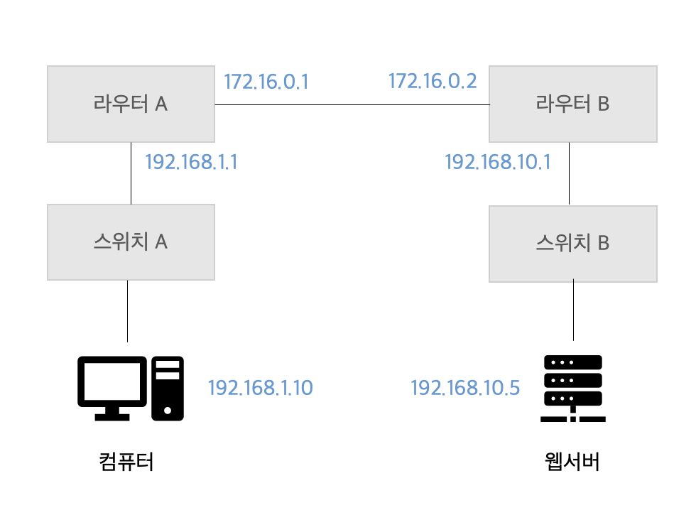
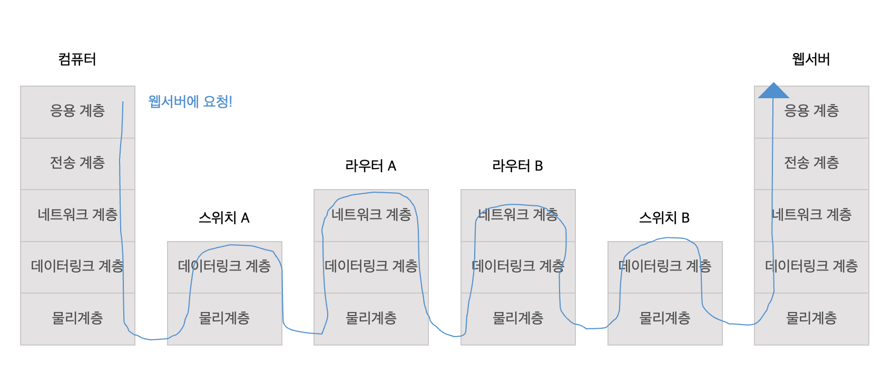

프론트엔드 개발자의 테크 면접 필수 질문 중 하나는 "브라우저의 동작 원리"인데요.

간단하게 정리해보면 아래와 같습니다.

- 파싱 : HTML을 통해 DOM 트리를, CSS를 통해 CSSOM 트리를 빌드
- 랜더 트리 : DOM과 CSSOM을 결합하여 랜더 트리 형성
- 레이아웃 및 리플로우 : 랜더 트리에서 레이아웃을 실행하여 각 노드의 기하학적 형태를 계산
- 페인트 : 개별 노드를 화면에 페인트

이번 포스팅에서는 그동안 익숙했던 프론트엔드 관점이 아닌!

네트워크의 관점에서 데이터가 어떻게 흘러가고, 우리에게 도달하는지 정리를 해보겠습니다.

---

## 네트워크 구성

웹 사이트에 접속할 때, OSI 모델에서 발생하는 일을 정리하면 다음과 같습니다.

- `응용 계층` (세션 계층, 표현 계층 포함) : 애플리케이션 등에서 사용하는 데이터를 송수신
- `전송 계층` : 목적지에 데이터를 정확하게 전달
- `네트워크 계층` : 다른 네트워크에 있는 목적지에 데이터를 전달
- `데이터 링크 계층` : 랜에서 데이터를 송수신
- `물리 계층` : 데이터를 전기 신호로 변환

위의 네트워크 구성에서 네트워크의 갯수는 `192.168.1.0/24`, `172.16.0.0/16`, `192.168.10.0/24` 로 총 3개입니다.

또한 예시로 첨부한 네트워크 구성을 OSI 모델로 표현하면 위의 이미지처럼 정리할 수 있습니다.

사용자가 웹 브라우저에 URL을 입력하고, 웹 서버에 도착할 때까지 `캡슐화`와 `역캡슐화` 과정이 존재합니다.

---

## 컴퓨터의 데이터가 전기 신호로 변환되는 과정 (캡슐화)

먼저 컴퓨터에서 OSI 모델의 캡슐화가 이루어집니다. `응용 계층`부터 시작이 되며, 사용자가 웹 브라우저에 URL을 입력하고 접속하는 순간, `캡슐화`가 진행됩니다. (`3-way 핸드쉐이크`는 이미 완료되어 연결이 확립되어 있다 가정)

### 1. 응용 계층 -> 전송 계층

웹 브라우저를 이용하여, 웹 서버의 웹 사이트를 접속하기 위한 요청은 `HTTP` 프로토콜입니다. 응용 계층은 전송 계층으로 HTTP 메시지를 보냅니다.

- ex. `GET /index.html HTTP/1.1`

### 2. 전송 계층 -> 네트워크 계층

전송 계층에서는 `TCP 헤더`가 붙습니다. **출발지 포트 번호**와 **목적지 포트 번호**를 담고 있습니다. TCP 헤더를 가진 데이터는 `세그먼트`입니다. 이 세그먼트를 네트워크 계층에 전달합니다.

### 3. 네트워크 계층 -> 데이터 링크 계층

네트워크 계층에서는 전달받은 세그먼트에 `IP 헤더`를 추가로 붙입니다. **출발지 IP 주소**와 **목적지 IP 주소**를 붙이는데, IP 헤더가 붙는 데이터는 IP 패킷이라고 합니다.

### 4. 데이터 링크 계층 -> 물리 계층

`이더넷 헤더`가 추가됩니다. 이더넷 헤더가 존재하는 데이터는 `이더넷 프레임`이라고 합니다. 이더넷 프레임까지 전달받은 물리 계층에서는 전기 신호로 변환되어 네트워크로 전송됩니다. 물리 계층에서 전기 신호로 변환할 때는 `LAN 카드`가 활용됩니다.

---

## 스위치와 라우터에서의 데이터 전달과 처리

### 스위치에서는

- 데이터 링크 계층 -> 물리 계층

컴퓨터에서 들어온 데이터가 전기 신호로 변환되어 처리됩니다.

### 라우터에서는

- 물리 계층 -> 데이터링크 계층 -> 네트워크 계층

스위치에서 데이터가 전기 신호로 변환되어 흘러가 라우터에 도착하면, **데이터 링크 계층**에서 **이더넷 프레임의 목적지 MAC 주소와 자신의 MAC 주소를 비교**합니다.

이때 주소가 같다면, 이더넷 헤더와 트레일러를 분리하는 `역캡슐화`를 진행합니다. 다음으로 네트워크 계층으로 전달하여, 자신의 **라우팅 테이블과 목적지 IP 주소를 비교**합니다.

라우팅 테이블에서 **목적지 IP 주소의 경로**를 알 수 있어, `라우팅`을 할 수 있습니다. 현재 출발지 IP 주소를 라우터의 외부 IP 주소로 변경합니다.

또 다시 다음 라우터로 보내기 위해 데이터 링크 계층으로 전달해, **이더넷 헤더와 트레일러** 붙인 후, 물리 계층에서 데이터를 **전기 신호로 변환**하여 네트워크로 전달합니다.

---

## 웹 서버에서의 데이터 전달과 처리

데이터가 최종적으로 웹 서버 `물리 계층`에서 전기 신호로 도착합니다.

웹 서버는 `데이터 링크 계층`에서 이더넷 프레임의 목적지 MAC 주소와 자신의 MAC 주소를 비교합니다.

같다면 이더넷 헤더와 트레일러를 분리하고, `네트워크 계층`에 전달합니다.

네트워크 계층에서는 목적지 IP 주소와 웹 서버의 IP 주소가 같은지 확인합니다. 주소가 같다면 IP 헤더를 분리하고 `전송 계층`에 전달합니다.

전송 계층에서는 목적지 포트 번호를 확인해, 어떤 애플리케이션으로 전달해야 하는지 판단하고, TCP 헤더를 분리해 `응용 계층`으로 전달합니다.

마지막입니다! 응용 계층은 HTTP 요청을 보내 웹 사이트에 접속합니다. 사용자의 컴퓨터에섯 웹 서버까지 데이터가 도달하였습니다.

---

위의 정리된 `캡슐화`, `역캡슐화` 과정의 반복을 통해 우리는 컴퓨터와 웹 서버 사이에서 요청과 응답을 주고 받습니다.

기존의 `프론트` 관점에서 브라우저의 동작 과정 뿐만 아니라, `네트워크` 관점에서 장비에서 이루어지는 데이터 처리 과정을 정리해보며, 데이터를 주고 받기 위해 어떤 흐름이 동작되는지 더 깊이 있게 이해할 수 있었습니다.

---

- 참고

1. [프론트엔드 개발자라면 알고 있어야 할 브라우저의 동작 과정](https://yozm.wishket.com/magazine/detail/1338/)
