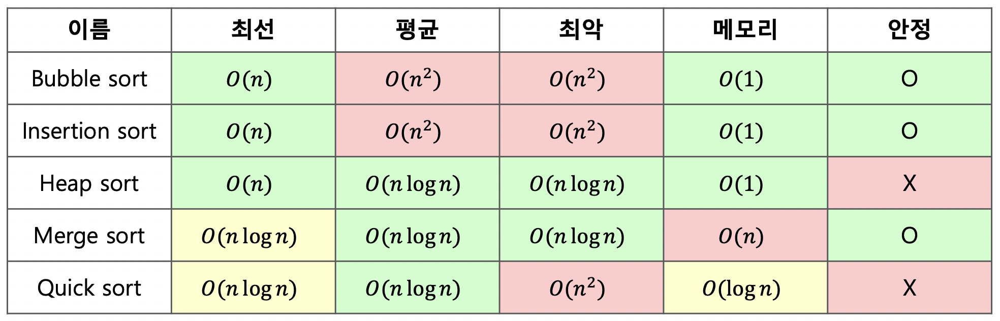

최근 학교 친구와 기술 스터디를 진행하게 되었는데요.

전공 수업 내용이 가물가물해지던 요즘, 알고리즘부터 시작하여 차근차근 CS 지식 복습을 진행하고 있습니다.

그러던 중 sort 를 다시 복습하게 되었습니다. 정렬 알고리즘에는 거품 정렬, 선택 정렬, 삽입 정렬, 퀵 정렬, 병합 정려르 힙 정렬, 기수 정렬, 계수 정렬 ... 등 다양한 정렬 방법이 존재합니다.

해당 정렬 방법은 각각 특징이 있고, 시간 복잡도도 비교 가능하며, stable 한 알고리즘인지도 평가할 수 있습니다.

---

JavaScript 언어도 sort 메서드를 제공하고 있습니다.

### [Array.prototype.sort()](https://developer.mozilla.org/ko/docs/Web/JavaScript/Reference/Global_Objects/Array/sort)

배열 요소를 정렬하고자 할 때, sort 함수를 사용합니다.

파라미터로 비교함수를 제공해서 사용할 수도 있고 (ex. `sort((a, b) => a-b)` ), 혹은 제공하지 않는다면 자동으로 요소를 **ASCII 문자를 기준으로 오름차순 정렬**을 해줍니다.

비교 함수를 다시 알아보자면, 첫 번째 요소(`a`)가 두 번째 요소(`b`)보다 우선 순위가 높다면 **음수**를 반환하고, 낮으면 **양수**를 반환하고, 같다면 **0**을 반환하는 방식으로 작성합니다.

sort 함수는 배열 탐색이나 알고리즘 문제 풀이에서 굉장히 자주 쓰이는 메서드입니다. 하지만 JavaScript에서 제공하는 sort 함수는 시간 복잡도가 어떻게 될까요? 요소를 모두 탐색하기 때문에 O(n)이 아닐까요? 그리고 어떤 알고리즘을 사용하는 걸까요?

이번 포스팅에서는 JS가 제공하는 sort 메서드는 어떤 정렬 알고리즘으로 구현되었으며, 시간 복잡도는 어떤지 간략하게 알아보려고합니다!

---

## JavaScript 의 정렬 알고리즘

사실 해당 자료를 찾기 어려웠습니다. 왜냐하면 Mdn 문서에는 `sort` 메서드가 어떠한 알고리즘을 사용하는지 명세되어 있지 않았기 때문입니다! 그 이유는 바로...

[자바스크립트를 해석하는 엔진에 따라 다른 정렬 알고리즘을 사용](https://stackoverflow.com/questions/57763205/what-is-array-prototype-sort-time-complexity)하기 때문이었습니다.

우선 JavaScript에서 사용하고 있는 대표적인 엔진입니다.

- V8 (Chrome, NodeJS)
- SpiderMonkey (Firefox)
- webkit (Safari)

### 1. V8

Chrome 브라우저와 NodeJS 의 V8 엔진입니다. 우선 V8은 과거와 현재 다른 알고리즘을 사용하고 있다고 합니다. 현재 적용된 알고리즘은 바로, `Tim Sort` 알고리즘입니다.

(+ Python, Java 의 sort 도 Tim Sort 알고리즘으로 구현된다고 합니다.)

해당 알고리즘을 한 줄로 정리하면, **Insertion Sort 와 Merge Sort 를 결합한 알고리즘**입니다.

**안정적인** 두 알고리즘을 결합하였기에 안정적이며, 추가 메모리를 사용하지만 기존에 사용했던 Merge Sort 에 비해 적은 추가 메모리를 사용하여 단점을 극복한 알고리즘입니다.

해당 알고리즘의 아이디어는 '**전체를 작은 덩어리로 자른 후, 각각의 덩어리들을 삽입 정렬로 정렬한 후, 합병 정렬을 수행하면 빠르고 안정적이게 정렬할 수 있을 것이다**' 입니다.

Tim Sort에 대해 더 자세히 알고 싶다면 아래 Tim Sort 관련 참조 문서를 참고해주세요!

- 시간 복잡도 : 최선 `O(N)`, 평균 `O(NlogN)`, 최악 `O(NlogN)`

### 2. SpiderMonkey

firefox 의 SpiderMonkey 엔진입니다. 해당 엔진은 `Insertion Sort` 와 `Merge Sort` 를 혼용하여 사용합니다.

- 길이가 24 이하인 경우, **Insertion Sort**
- 그 이상인 경우, **Merge Sort**

### 3. webkit

safari 의 webkit 엔진입니다. 해당 엔진은 `Bucket Sort` 와 `Merge Sort` 를 혼용하여 사용합니다.

- string 의 경우, **Bucket Sort**
- string 이 아닌 경우, **Merge Sort**

---

JavaScript 의 sort 메서드에 대해 알아보니, 주로, 길이가 짧은 배열에서 삽입 정렬을 수행하고, 길어진다면 합병 정렬을 통해 크게 문제를 나누거나 빠르게 정렬을 수행하였습니다.

다른 언어에서도 적용 중인 `Tim Sort`에 대해서도 새롭게 접할 수 있는 기회였네요!

**최대한 빠르게 정렬을 수행하면서, 또 안정성을 잃지 않게 하기 위한 고민**을 엿볼 수 있었습니다.

나도 효율성과 안정성 모두 고려할 수 있는 개발자가 되어야지! 🤔 또 한 번 다짐합니다!

---

- 참고

1. V8 Array Sort : https://v8.dev/blog/array-sort
2. Tim sort에 대해 알아보자 (Naver D2) : https://d2.naver.com/helloworld/0315536
3. Spidermonkey Array Sort : https://searchfox.org/mozilla-central/source/js/src/builtin/Sorting.js#78
4. webkit Array Sort : https://github.com/WebKit/WebKit/blob/main/Source/JavaScriptCore/builtins/ArrayPrototype.js#L560
