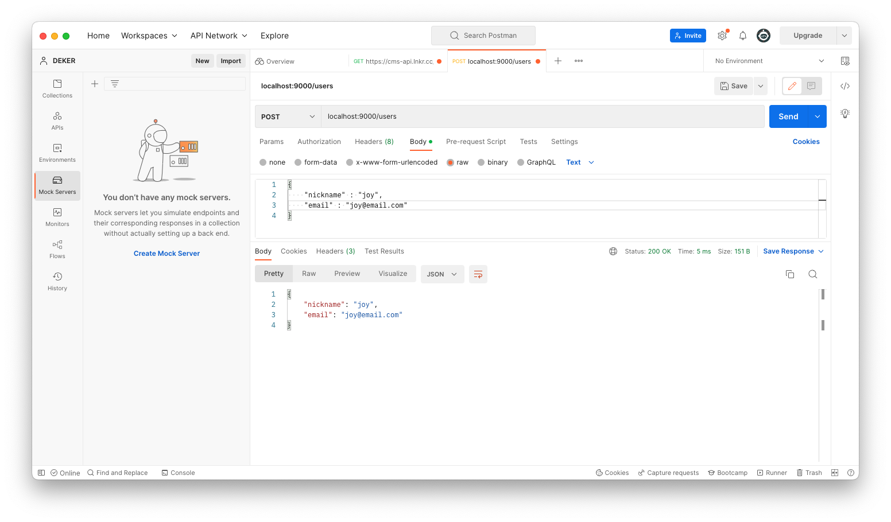
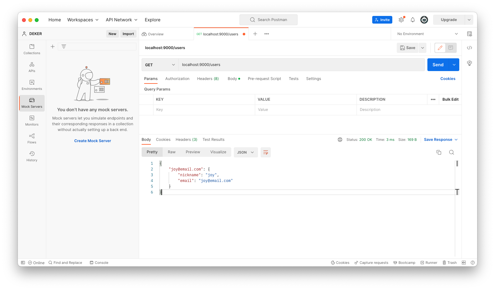

Go는 Http 서버를 만들 수 있는 패키지를 제공하고 있습니다.

```go
import "net/http"
```

## 1. http 서버 시작하기

가장 먼저 http 서버를 시작해보겠습니다. `http.ListenAndServe()` 함수를 통해 서버를 시작할 수 있습니다. 해당 함수는 2개의 매개변수를 요구합니다.

- ip, port 정보
- handler 타입 : request를 처리하는 response handler
  - nil : 기본적으로 동작하는 default server multiplexer가 동작합니다. 혹은 직접 커스텀한 handler를 넣을 수 있습니다.

```go
package main

import "net/http"

func main() {
	http.ListenAndServe(":9000", nil)
}
```

- 첫 번째 인자 : `localhost` 의 `9000` 번 포트로 서버를 시작하겠다는 의미입니다. 만약 지정된 IP와 Port 번호가 있다면 대체해도 좋습니다.
- 두 번째 인자 : 우선 기본 값인 `nil` 을 넣어주었습니다.

(+ go는 `go run {파일명}.go` 로 시작할 수 있는데, 실행되더라도 터미널에 별도의 메시지가 출력되지 않는 것 같습니다...! 처음에 프리징이 걸린 줄 알고 삽질을 살짝했습니다.)

## 2. request, response 주고받기

go http server는 두 개의 중요한 기능을 포함합니다. client로부터 request를 listen 하고, request에 맞게 response를 처리하는 기능입니다. `http.HandleFunc` 함수를 통해 request, response 를 구현할 수 있습니다. `http.HandleFunc` 함수 또한 두 개의 매개변수를 받습니다.

- 요청에 대한 Url 경로
- request에 대해 응답할 handler 함수
  - handler는 아래와 같은 형태를 가졌습니다.
    ```go
    func(ResponseWriter, *Request)
    ```

이제 예제를 구현해보겠습니다. "/" url 로 요청이 들어오면 "hello"를 보내주는 API를 작성해보겠습니다.

```go

package main

import "net/http"

func HelloHandler(res http.ResponseWriter, req *http.Request) {
	res.Write([]byte("hello world!!\n"))
}

func main() {
    http.HandleFunc("/", HelloHandler)
	http.ListenAndServe(":9000", nil)
}
```

## 3. Method 별 응답 나누기

http는 라우팅을 메서드 별로 따로 설정해주는 기능이 없어 함수 내부에서 메서드를 확인하여, 타입에 맞게 response 값을 설정할 수 있습니다.

아래 예시는 User에 대한 정보를 `POST`, `GET` 하는 API 입니다.

```go
package main

import (
	"encoding/json"
	"net/http"
)

var users = map[string]*User{}

type User struct {
	Nickname string `json:"nickname"`
	Email    string `json:"email"`
}

func main() {
	http.HandleFunc("/users", func(wr http.ResponseWriter, r *http.Request) {
		switch r.Method {
            case http.MethodGet:
                json.NewEncoder(wr).Encode(users)

            case http.MethodPost:
                var user User
                json.NewDecoder(r.Body).Decode(&user)

                users[user.Email] = &user // user의 email을 key로 하여 유저 정보를 저장
                json.NewEncoder(wr).Encode(user)
		}
	})
	http.ListenAndServe(":8080", nil)
}
```

위 API는 정상적으로 동작하지만, 일반 text로 인코딩 된다는 점이 아쉽습니다. Response Header에 `Content-Type`을 설정하여 json 형식으로 변경할 수 있습니다. 해당 작업은 처음에 `ListenAndServe` 함수 두 번째 인자 값인 Handler 함수를 커스텀하여 반영할 수 있습니다.

```go
func jsonMiddleware(next http.Handler) http.Handler {
	return http.HandlerFunc(func(rw http.ResponseWriter, r *http.Request) {
		rw.Header().Add("Content-Type", "application/json") // 헤더 설정
		next.ServeHTTP(rw, r)  // 전달 받은 http.Handler 호출
	})
}
```

해당 작업은 `gorilla/mux` 패키지를 추가하여 적용할 수 있습니다. 우선 `go get github.com/gorilla/mux`을 통해 패키지를 불러온 후 import 합니다.

```go
package main

import (
	"encoding/json"
	"net/http"

	"github.com/gorilla/mux"
)

// 코드 생략

func jsonMiddleware(next http.Handler) http.Handler {
	return http.HandlerFunc(func(rw http.ResponseWriter, r *http.Request) {
		rw.Header().Add("Content-Type", "application/json") // 헤더 설정
		next.ServeHTTP(rw, r)  // 전달 받은 http.Handler 호출
	})
}

func main() {
	// 라우터 생성
	router := mux.NewRouter()

	router.HandleFunc("/users", func(wr http.ResponseWriter, r *http.Request) {
		switch r.Method {
            case http.MethodGet:
                json.NewEncoder(wr).Encode(users)

            case http.MethodPost:
                var user User
                json.NewDecoder(r.Body).Decode(&user)

                users[user.Email] = &user // user의 email을 key로 하여 유저 정보를 저장
                json.NewEncoder(wr).Encode(user)
		}
	})

	// 9000 포트에 서버 띄우기.
    http.ListenAndServe(":9000", jsonMiddleware(router))
}
```

gorilla/mux 패키지는 `HTTP 요청 멀티플렉서` 입니다. API는 다양한 요청에 대한 응답이 필요한데, 이 요청들은 경로와 메서드(GET, PUT, PATCH, DELETE 등..)에 따라 나누어집니다. 여러 경로로 들어오는 요청에 적절한 핸들러를 매칭 시키기 위해 멀티플렉서를 사용합니다.

또한 handler 인터페이스를 구현하여 요청에 대해 일관적인 응답을 처리할 수 있습니다.



- POST Method 요청시 body로 보내 준 nickname, email 회원 정보를 저장합니다.



- GET Method 요청시 등록된 모든 사용자를 json 형태로 응답합니다.
