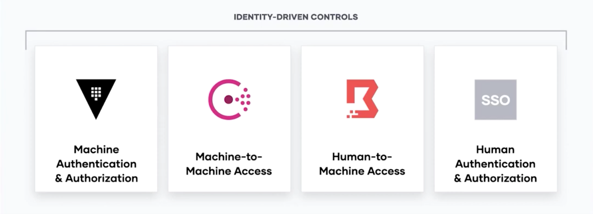

오늘은 저의 인생 첫 외근이자 기술 세미나를 다녀왔습니다 💓

제가 방문한 세미나는 `HashiCorp Strategy Day 2023`로, 클라우드를 위한 인프라 자동화 SW 기업 하시코프에서 주최하였습니다.

세미나는 환영 인사 및 CTO 아몬 데드가의 화이트 보드 세션으로 시작되었습니다. 제가 세미나에서 가장 집중해서 들었던 내용인데요. 하시코프가 현재 준비하고 있는 사업들, 무엇을 위해, 그리고 어떻게 준비하고 있는지 전체적인 로드맵을 이해할 수 있었습니다.

그 이후에는 HashiCorp의 기술들을 적용하고 있는 다른 회사들의 전략을 들을 수 있었습니다.

형식적인 PPT 발표가 아닌, 화이트 보드 라이브 세션을 진행하는 것이 인상깊었고, 동시 통역사가 열정적으로 통역을 진행해주셔서 기억에 남을 세미나가 될 것 같습니다. 세미나의 현장감이며 내용이며 모든 것이 새로웠던 날이였습니다 🥳

---

## Self Service For Developer

하시코프의 사업은 <`Self Service For Developer`> 한 줄로 정리되었습니다.

No Ticket, API를 자동화, 애플리케이션 구축에 있어 원활한 Cloud 구축 등을 돕는 것이 하시코프의 기술들이었습니다.

- **Security** : `Vault`(Machine To Machine), `Boundary`(human To Machine)
- **Provision** : `Terraform`(코드를 통한 Infra 구축)
- **Connect** : `Consul`(서비스 연결)
- **RunTime** : `Nomad`, `Waypoint`

세션에서 소개한 기술들을 100% 이해하지는 못했지만, 해당 기술들은 모두 `Zero Trust 패러다임` 아래에서 더 안전한 App 구축을 위해 고민되었다는 점은 이해할 수 있었습니다.

## Zero Trust ?

Zero Trust는 '`아무도 믿지 않는다`' 라는 패러다임으로 Cloud 에서의 보안을 이야기 하면서 언급된 주제입니다.

과거에는 IP 기반의 보안으로 허용되지 않은 IP 차단, 방화벽 같은 기술을 통해 서버를 보안하였습니다.

하지만 Cloud 기반의 환경에서는 IP가 계속 변경되며 과거의 방법이 통하지 않습니다.

이러한 상황에서 하시코프는 네트환경 내부라는 이유만으로 신뢰 하지 않는, 아무도 믿지 않는 `Zero Trust` 패러다임을 기반으로, Identity 기반의 보안을 강조하였습니다.

사용자, app, machine에 대한 명확한 인증, 인가, 그리고 기본적인 deny를 통해 보안의 그물망을 촘촘히 하는 목표를 가지고 있었습니다.

---

이렇게 Cloud 환경에서의 안정성있는 App 구축을 돕는 하시코프의 기술들을 엿볼 수 있었습니다.

이후에는 회사에서 적용되는 사례들을 볼 수 있었고, 대게 기업들에서 `Vault`와 `Terraform`을 적극적으로 활용하고 있는 것을 알게 되었습니다.

저 또한 회사에서 보안 검수를 경험해보면서, 제가 작성하는 코드, 서비스들이 과연 보안적으로 안전한지 한 번 더 고민하는 자세를 가질 수 있었는데요. 이번 세미나를 통해 `Zero Trust` 패러다임 아래에서 `Self Service For Developer in Cloud` 을 고민하는 하시코프 기술들에 좀 더 관심을 갖게 될 것 같습니다!
