LDAP(Lightweight Directory Access Protocol)는 사용자가 조직, 구성원 등에 대한 데이터를 찾는 데 도움이 되는 프로토콜입니다. 애플리케이션이 디렉터리 서비스와 정보를 주고 받는 데 필요한 통신 언어를 제공합니다. 디렉터리 서비스는 네트워크 내에서 조직, 개인 및 기타 데이터에 대한 정보가 있는 위치에 액세스할 권한을 제공합니다.

## 활용 사례

- LDAP는 LDAP 디렉터리에 데이터를 저장하고 사용자가 디렉터리에 액세스할 수 있도록 **인증**하기 위해 주로 사용됩니다.

- 디렉터리 서비스에 액세스하여 해당 서비스를 관리할 수 있는 **중앙 위치를 제공**하는 것입니다.

  - LDAP를 사용하는 조직은 조직, 조직의 사용자, 자산(예: 사용자 이름, 암호)에 대한 정보를 저장, 관리, 보호할 수 있습니다.
  - LDAP는 정보 계층 구조를 제공하여 스토리지 액세스를 간소화하는 데 도움이 되고, 기업이 성장하면서 더 많은 사용자 데이터와 자산을 확보함에 따라 중요할 수 있습니다.

- **즉, 중앙관리가 필요하고 검색에 최적화된 서비스를 제공합니다.**

## 주요 용어

- DN : Distinguish Name
- RDN : Relative Distinguished Name
- DIT : Directory Information Tree
- LDIF : LDAP Data Interchange Format
- UID : User ID
- DC : Domain Component
- OU : Organizational Unit

## LDAP의 디렉터리 구조

- LDAP 서버에는 여러 디렉토리 정보(entry)가 계층적 트리 구조(hierarchical tree-like)로 구성되어 있습니다.

```
dc:         com
             |
           domain         ## (Organization)
          /      \
ou:   People   servers    ## (Organizational Units)
      /    \     ..
uid: ..    Joy           ## (OU-specific data)
```

---

# OpenLDAP으로 LDAP 구축하기

[openLDAP](https://www.openldap.org/)을 활용하여 LDAP 을 구축해보기로 합니다!

우선은 Directory 서비스를 위한 LDAP 서버를 구축해야 하는데, 저는 AWS EC2 인스턴스를 발급받아 Ubuntu 환경를 준비하였습니다. (`Ubuntu 20.04.6 LTS`)

### 1. OpenLDAP 관련 유틸리티 설치

```
$ sudo apt-get update
$ sudo apt-get install slapd ldap-utils
```

- 설치 중 Admin Password 를 입력해야 합니다. 이후 셋팅에서 변경 가능합니다.

### 2. OpenLDAP 셋팅

```
$ sudo dpkg-reconfigure slapd
```

- 패키지 설치 후 재설정을 진행합니다. 아래 옵션에 대한 설명을 참고해주세요!

- Omit OpenLDAP server configuration?

  - 생략하지 않고 환경 설정을 진행합니다.
  - 예시 : **No**

- DNS domain name:

  - LDAP 디렉토리의 Base `DN` 값을 설정하기 위한 `DNS 이름`을 설정합니다.
  - 예시 : "example.com"의 base DN은 **"dc=example, dc=com"**이 됩니다.

- Organization name:

  - LDAP 디렉토리의 Base `DN`이 사용하는 `조직 명`을 설정합니다.
  - 예시 : **dev**

- Administrator password:

  - LDAP 디렉토리의 admin의 패스워드를 입력/재입력합니다.
  - 예시 : **secret** / **secret**

- Do you want the database to be removed when slapd is purged?

  - slapd를 삭제하였을 때 DB를 삭제할지에 대한 옵션입니다. DB 삭제는 민감한 문제이니 No 옵션을 선택하였습니다.
  - 예시 : **No**

- Move old database?
  - `/var/lib/ldap`에 DB가 존재하는 있는 경우, 이전 DB를 `/var/backups` 위치로 이동시킵니다.
  - 예시 : **Yes**

### 3. LDAP 관리를 위한 GUI 프로그램 설치

LDAP 설정은 CLI로도 가능하지만, 직관적으로 관리하기 편한 GUI 가 존재합니다.

저는 eclipse기반 LDAP 브라우저 클라이언트인 ['Apache Directory Studio'](https://directory.apache.org/studio/)를 선택하였습니다.

이 외에도 LDAP을 다루기 위한 SW 정보는 [List Of LDAP software](https://en.wikipedia.org/wiki/List_of_LDAP_software) 라는 위키에 정보가 저장되어 있습니다.

### 4. Apache Directory Studio

해당 글에서는 아래 작업을 진행하였습니다.

- **그룹 생성 및 유저 정보 추가**
- **그룹 검색 기능 추가**

**4-1. LDAP Connection**

우선 Apache Directory Studio를 실행하면, `Select a wizard` > `LDAP Connection` 를 통해 LDAP 서버와 GUI를 연동시켜줄 것입니다.

Hostname, Port 를 작성한 후 다음 단계로 진행합니다. 기본적으로 LDAP은 `389`번 포트를 가집니다. (+ AWS EC2 로 서버를 구축하셨다면 인바운드 규칙에서 해당 포트를 꼭 열어주세요!)

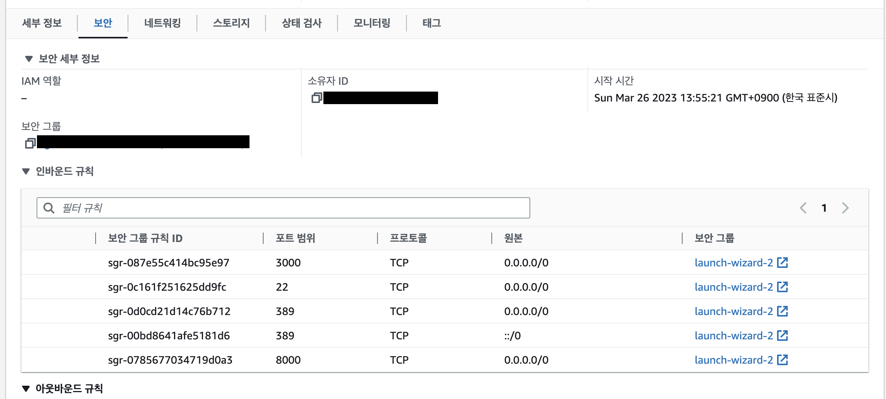

Authentication에 대한 셋팅을 진행합니다. Bind DN or USER 에 대한 정보는 초기에 LDAP 환경 설정을 했을 때의 `DN 정보`를 입력하면 됩니다. `dc=example, dc=com`

만약 정보를 잊으셨다면, LDAP 서버에서 `sudo slapcat` 명령어를 입력하면 dn 정보를 확인할 수 있습니다.

**4-2. 그룹 생성**

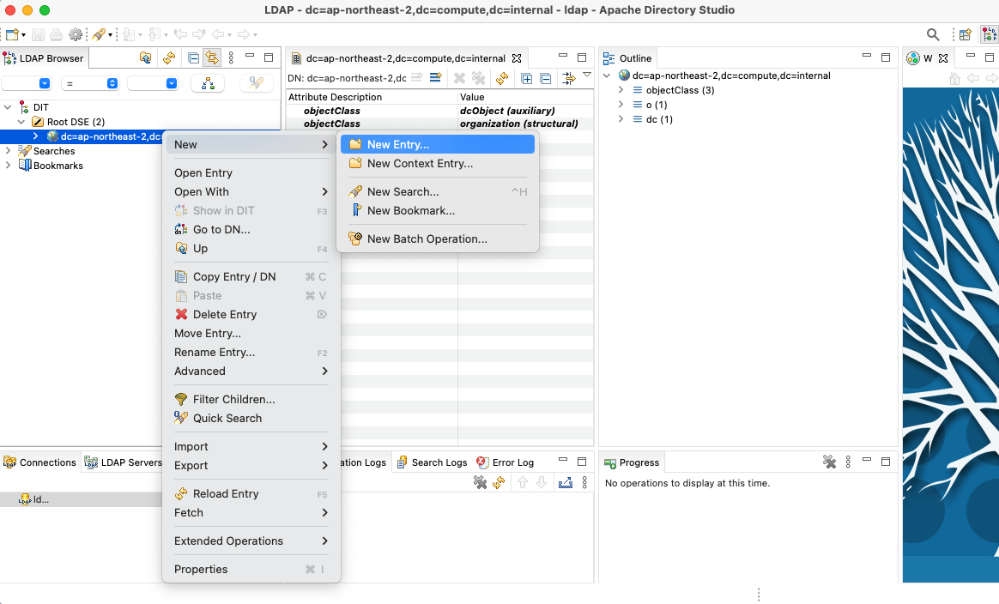

LDAP 그룹을 생성합니다. root entry 경로에서 New Entry 를 선택해 Entry를 추가합니다.

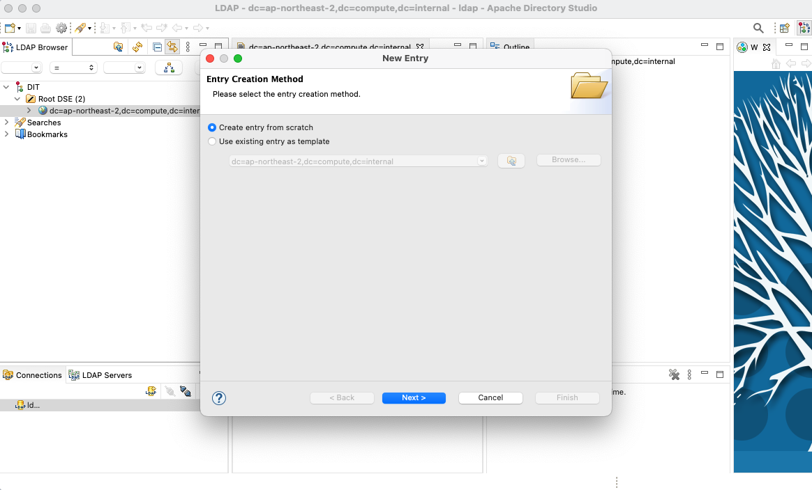

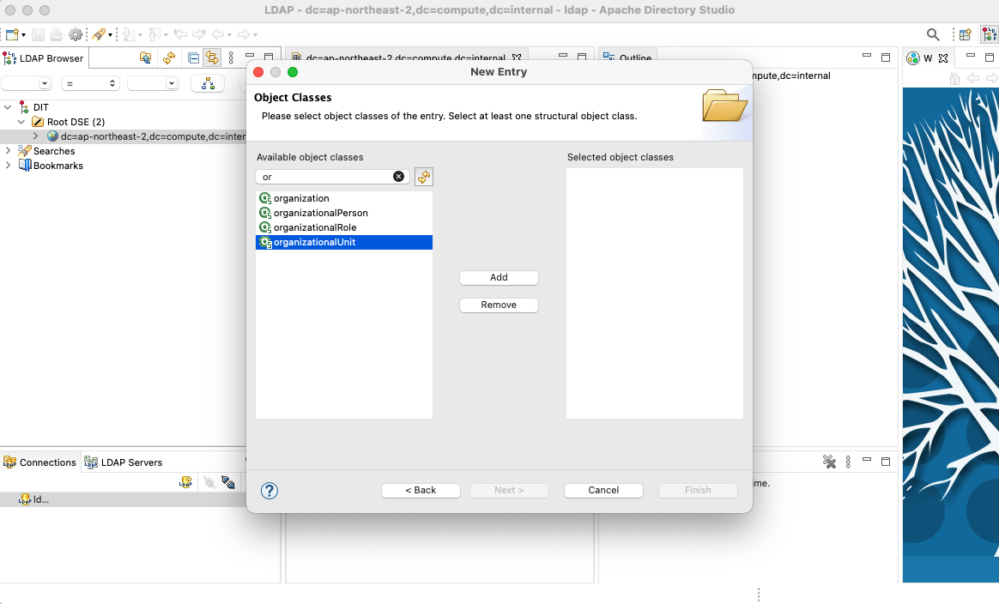

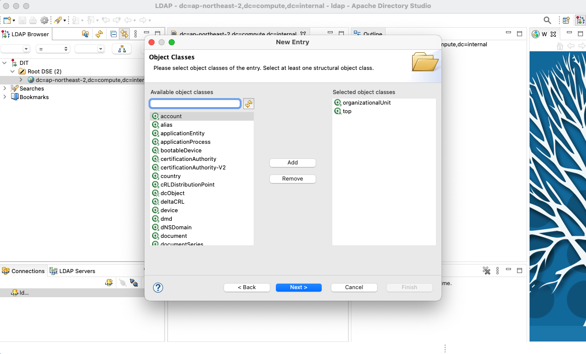

OrganizationalUnit 이라는 Object 를 생성해줍니다.

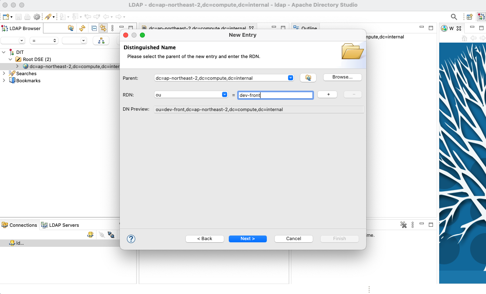

RDN을 `ou(Organizational Unit)`로 설정하고 그룹(부서)명을 입력합니다.

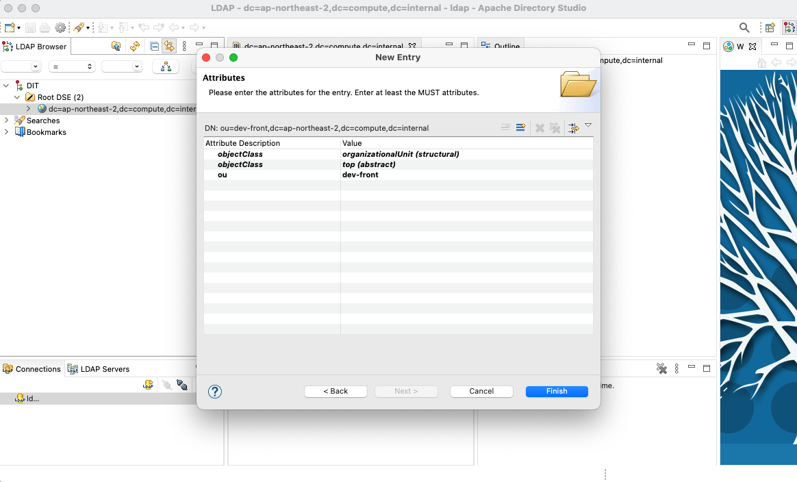

Finish를 누르면 생성됩니다. 다른 부서에 대한 Entry도 추가해봅니다!

**4-3. 유저 정보 추가**

이제 그룹 내부에 유저를 추가해봅니다. 생성된 ou Entry 하위에 New Entry 를 선택해 Entry를 추가합니다.

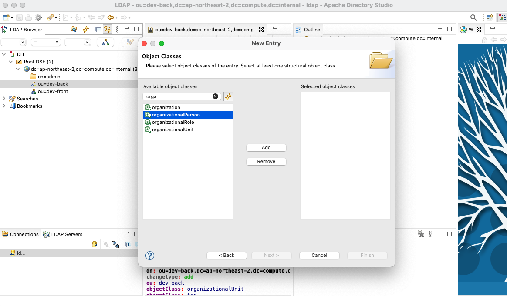

organizationalPerson 이라는 Object 를 생성해줍니다.

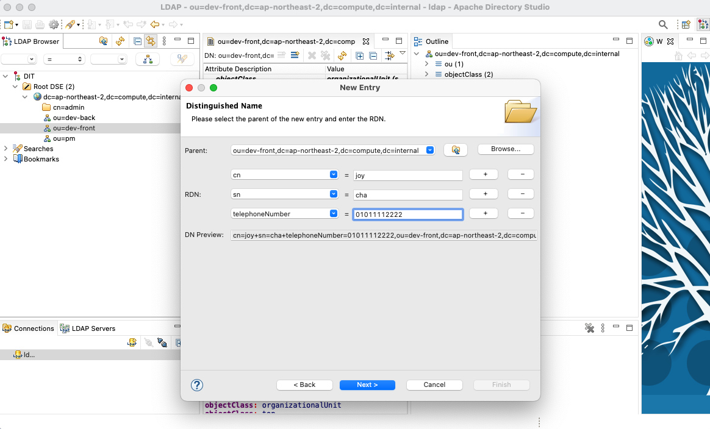

RDN 에 유저 정보를 추가합니다. cn, sn, telephoneNumber 정보를 입력해주었습니다.

GUI 에서는 기본적으로 제공하지 않는 속성이라면 오류를 던지는데요, 이 외의 속성을 추가하고 싶다면 (Ex. Email ...) 커스텀 할 수도 있습니다. 해당 포스팅에서는 다루지 않지만, `extensibleObject` 를 추가하는 작업으로 가능하다고 합니다.

**4-4. 검색 기능**

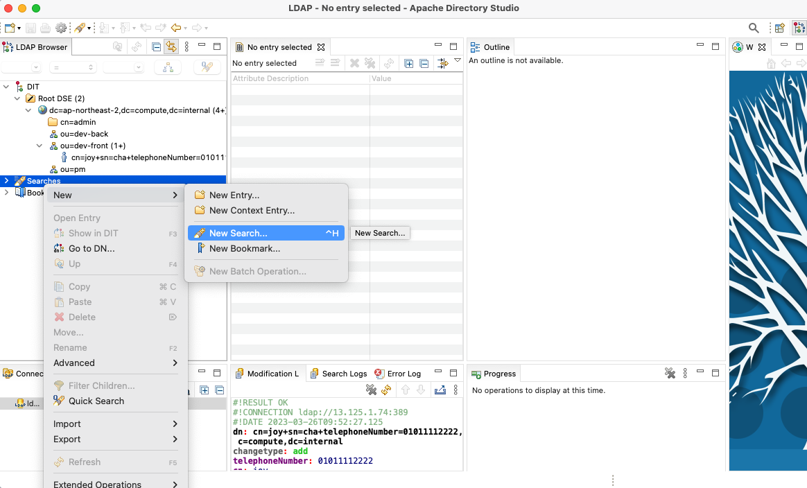

왼쪽 search 메뉴에서 New Search를 선택해 검색 기능을 생성할 수 있습니다.

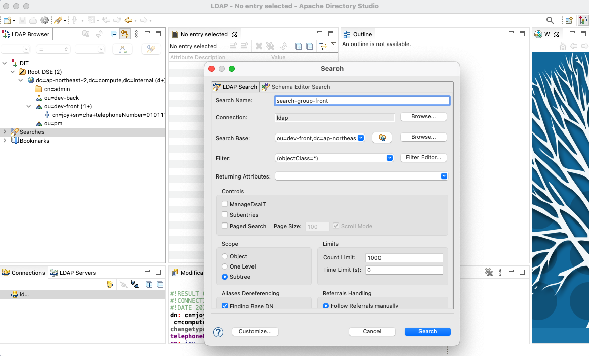

기능 구분을 위한 `검색명`과, `검색 대상의 DN`, `필터`를 선택하고 생성합니다.

해당 예시에서는 `dev-front` 그룹의 유저 정보를 모두 가져옵니다.

필터의 경우에는 문법을 알아야 사용가능하다고 합니다. 예를 들어 성이 `cha` 인 유저 정보를 찾고 싶다면? `(&(sn=cha))` 와 같은 문법을 작성해야 한다고 합니다.
